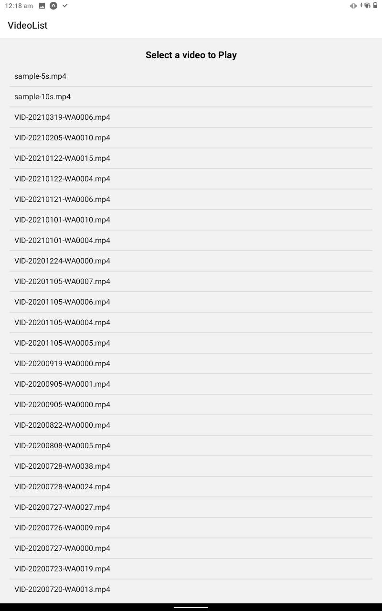
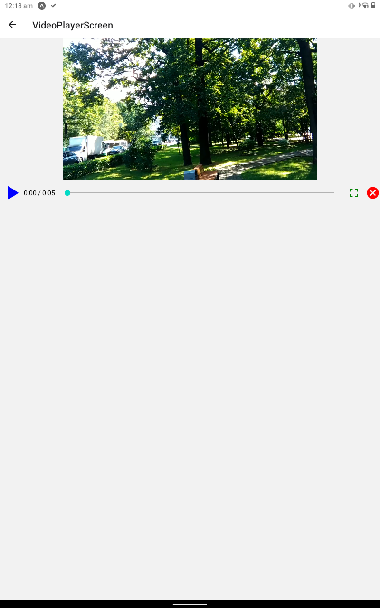

# Video Player App

## Description

Welcome to the Video Library Explorer! This mobile app is designed to help users discover and explore various video files available on their device. With this application, users can browse through their local videos, play them, and get detailed information about each video. Users can also bookmark their favorite videos for quick access. This README provides an overview of the app and instructions on how to set up and run it on your device.

## Project Links

* Github- [Video Player on GitHub](https://github.com/saurabhkumarr99/Video-Player-App)

## Table of Contents

- [Features](#features)
- [Getting Started](#getting-started)
- [Usage](#usage)
- [Code Structure](#code-structure)
- [Screenshots](#screenshots)
- [Author](#Author)

## Features

- **Video Search:** Search and filter local videos by name or location.
- **Responsive Design:**  Enjoy a user-friendly experience on both iOS and Android devices.

## Getting Started

### Prerequisites

- Node.js and npm (Node Package Manager) installed on your computer.
- Node.js: [Download and Install Node.js](https://nodejs.org/)

Follow these steps to run the Blog App locally:

1. **Unzip the Video Player App:**

2. **Navigate to the project directory:**

   ```bash
   cd VideoPlayerApp
   ``` 

2. **Install Dependencies:**

   ```bash
   npm install
   ``` 

3. **Run:**

   ```bash
      npx expo start
   ``` 


## Usage

- **Browse Videos**: Use the app to explore and search for videos by name or location.
- **Play Video**: Select play video.

## Code Structure

The project follows a structured directory layout for better organization:

- **allComponents/**: 
  - `AppNavigator.js/`
  - `VideoList.js`
  - `VideoPlayerScreen.js`


- **ScreenShots**: Folder conatining screenshots here.

  - **assets/**: Images, styles, and other assets.
    - `images/`: Folder containing project images.
  - `App.js`: The main application file that sets up routing and renders components.

- `package.json`: The project dependencies and scripts configuration.

- `README.md`: This file, which provides an overview of the project's structure and usage instructions.

## Screenshots

<p align="center">
  
  
</p>


## Author

- SAURABH KUMAR RAI

